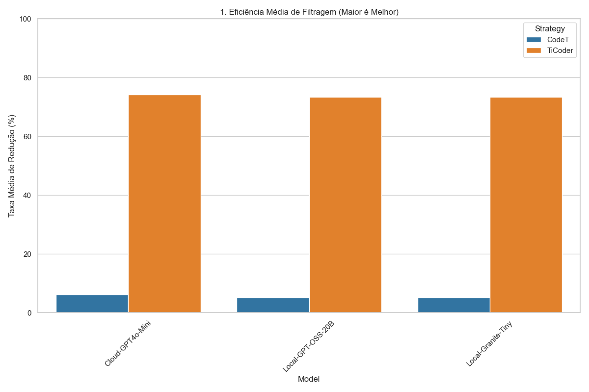

# 🚀 TiCoder-SLM: Efficient Test-Driven Code Generation with Local LLMs

> **An optimized, architecture-agnostic implementation of Test-Driven Code Generation (TiCoder) focused on efficiency, privacy, and zero-cost execution using Local Small Language Models (SLMs).**

This repository refactors the original TiCoder logic into a clean architecture, enabling direct comparison between Oracle-based (**TiCoder**) and Consensus-based (**CodeT**) strategies using consumer hardware (e.g., RTX 3060) via LM Studio or the OpenAI API.

---

## 📊 Key Results

Our benchmarks demonstrate that **Local SLMs** (Small Language Models) can match the performance of proprietary Cloud models in test generation tasks, while TiCoder significantly outperforms CodeT in low-resource scenarios.


*(Figure: Average Candidate Reduction Rate on HumanEval Dataset, N=21)*

### Key Findings

1. **Local vs. Cloud Parity:** The local **Granite-Tiny** model (running on <3GB VRAM) achieved a **73.33% reduction rate**, effectively tying with the larger **Local-GPT-OSS-20B (73.33%)** and falling less than 1% behind the proprietary **Cloud-GPT-4o-mini (74.29%)**. This proves that massive parameter counts are not strictly necessary for effective test generation.

2. **Strategy Efficiency:** In low-sampling regimes ($N=20$), **TiCoder** (Oracle-based) is far superior, reducing the search space by ~74% on average. In contrast, **CodeT** (Consensus) fails to filter incorrect candidates effectively without massive sampling ($N>100$), maintaining ~95% of the candidates (only ~5% reduction).

3. **Zero Cost:** The entire pipeline was validated running locally with zero inference costs, offering a privacy-first alternative to API-dependent workflows.

---

## 🛠️ Features

* 🧩 **Agnostic Architecture:** Seamlessly switch between **Local LLMs** (via LM Studio/OpenAI-Like server) and Cloud APIs (OpenAI) just by changing an environment variable.
* 🧹 **Clean Implementation:** Pythonic, modular code without the dependency hell of legacy research repositories.
* 📉 **Integrated Benchmarking Suite:** Automated tools to run comparisons across datasets (HumanEval/MBPP) and generate visualization charts.
* 🧠 **In-Context Learning:** Uses optimized Few-Shot Chain-of-Thought prompting to guide small models in generating complex edge-case tests.

---

## 📂 Project Structure

```text
.
├── data/                   # Generated candidates cache
├── data_history/           # JSON database of benchmark runs
├── datasets/               # Ground Truth datasets (HumanEval/MBPP)
├── src/
│   ├── benchmark_runner.py # Main entry point for experiments
│   ├── generate_candidates.py # Generates code solutions (Cache)
│   ├── plot_dashboard.py   # Generates comparison charts
│   ├── core/
│   │   ├── slm_manager.py  # Prompt Engineering & Test Gen Logic
│   │   ├── oracle.py       # Ground Truth validation
│   │   └── codet.py        # Consensus logic implementation
│   └── utils/              # Data loaders and sandboxed execution
└── requirements.txt
```

---

## 🚀 Getting Started

### 1. Prerequisites

* Python 3.10+
* [LM Studio](https://lmstudio.ai/) (For local execution)
* Git

### 2. Installation

```bash
git clone https://github.com/rleiteoliveira/Efficient-Code-Generation-Benchmark
cd Efficient-Code-Generation-Benchmark
python -m venv venv

# Windows
.\venv\Scripts\Activate

# Linux/Mac
source venv/bin/activate

pip install -r requirements.txt
```

### 3. Configuration (.env)

Create a `.env` file in the root directory:

```ini
# --- OPTION A: LOCAL EXECUTION (Recommended) ---
# Point to your local LM Studio server (Start server on port 1234)
SLM_BASE_URL="http://localhost:1234/v1"
SLM_MODEL="local-model-id"

# OpenAI Key is required only if you want to generate new candidates with GPT-3.5
OPENAI_API_KEY="sk-..." 

# --- OPTION B: CLOUD EXECUTION ---
# Comment out SLM_BASE_URL to use OpenAI official endpoints
# SLM_BASE_URL="http://localhost:1234/v1"
SLM_MODEL="gpt-4o-mini"
```

---

## 🔬 How to Reproduce Results

### Step 1: Generate Candidate Cache

Generate code solutions for the dataset (e.g., 50 candidates per problem). This step usually requires a stronger model (GPT-3.5/4) to create the initial search space.

```bash
python src/generate_candidates.py
```

### Step 2: Run the Benchmark

Run the comparison using your chosen model (Local or Cloud). This script runs both TiCoder and CodeT strategies.

```bash
# Example running with a local model loaded in LM Studio
python src/benchmark_runner.py --model_name "Local-Granite-3B" --candidates_file data/candidates_cache.json
```

### Step 3: Visualize

Generate the comparison chart based on the history of all runs.

```bash
python src/plot_dashboard.py
```

> Check the `results_charts/` folder for the generated PNGs.

---

## 🧠 Methodology

### TiCoder (Test-Driven User-Intent Formalization)

* **Concept:** Uses the LLM to generate a "discriminating test case" (an input where candidate codes disagree).
* **Validation:** Asks an Oracle (User or Ground Truth) for the correct output.
* **Action:** Prunes all candidates that fail to produce the Oracle's output.
* **Result:** Extremely high pruning rate, even with few candidates.

### CodeT (Code Termination)

* **Concept:** Executes generated tests on all candidates and clusters them by output.
* **Validation:** Assumes the largest cluster (Consensus) is correct.
* **Action:** Keeps only the candidates in the majority cluster.
* **Result:** Requires large N (N>50) to be effective; fails to filter effectively in low-resource settings.

---

## 📚 References

This project is a clean, independent reproduction inspired by the methodology presented in:

> **TiCoder (Primary Source):** [LLM-Based Test-Driven Interactive Code Generation: User Study and Empirical Evaluation](https://ieeexplore.ieee.org/abstract/document/10606356) - *Fakhoury et al. (IEEE Transactions on Software Engineering, 2024)*

